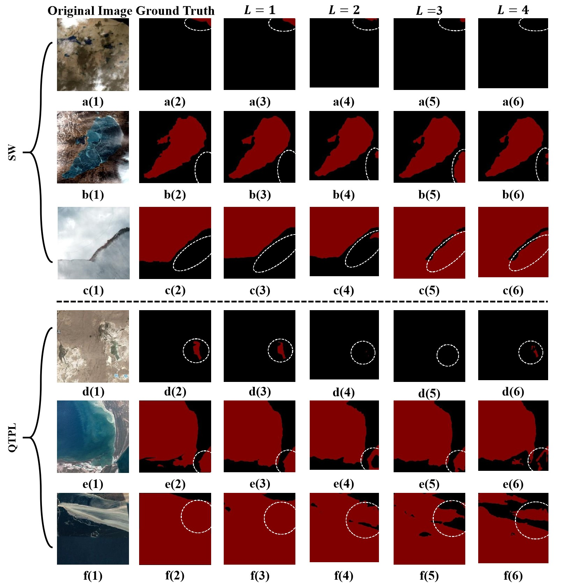
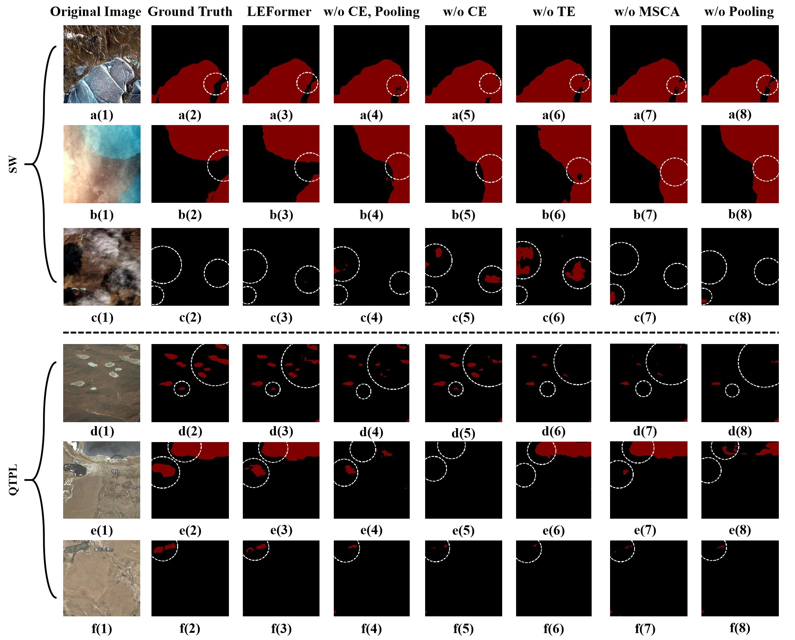
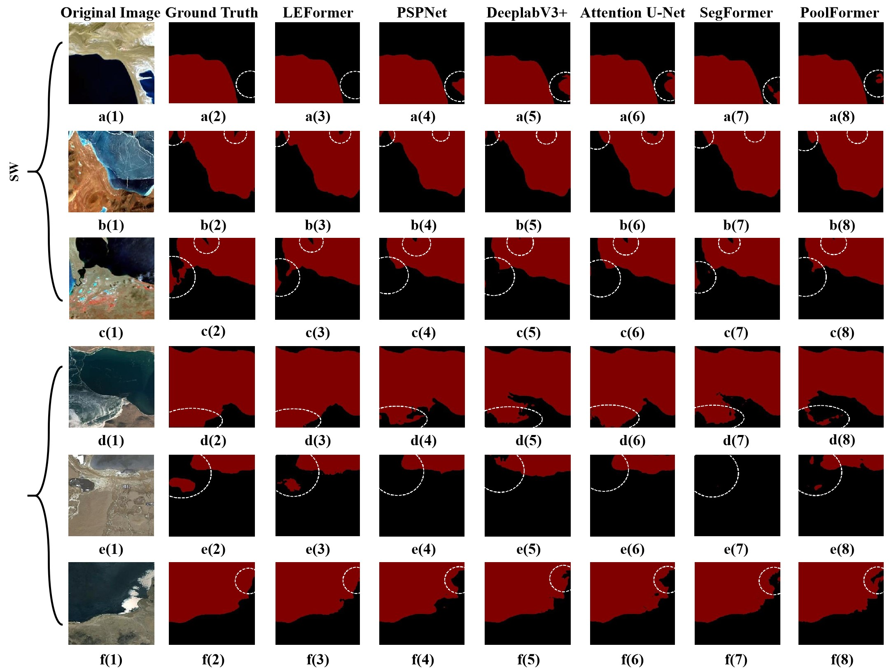

# LEFormer: A Hybrid CNN-Transformer Architecture for Accurate Lake Extraction from Remote Sensing Imagery


The repository contains official PyTorch implementations of training and evaluation codes and pre-trained models for **LEFormer**.

[//]: # (The paper is in [Here]&#40;https://arxiv.org/pdf/2209.08575.pdf&#41;.)

The code is based on [MMSegmentaion v0.30.0](https://github.com/open-mmlab/mmsegmentation/tree/v0.30.0).

## Installation

For install and data preparation, please refer to the guidelines in [MMSegmentation v0.30.0](https://github.com/open-mmlab/mmsegmentation/tree/v0.30.0).

An example (works for me): ```CUDA 10.1``` and  ```pytorch 1.6.0``` 

```
pip install -U openmim
mim install mmcv-full
cd LEFormer && pip install -e . --user
```

### Datasets Preparation
The Surface Water dataset (SW dataset) is freely available for download [here](https://aistudio.baidu.com/aistudio/datasetdetail/75148).  
The Qinghai-Tibet Plateau Lake dataset (QTPL dataset) is freely available for download [here](http://www.ncdc.ac.cn/portal/metadata/b4d9fb27-ec93-433d-893a-2689379a3fc0).  


- Run tools/data_split.py to randomly split your paired datasets into training and testing sets.
- The structure of datasets are aligned as follows:
```
SW or QTPL

├── annotations
│　　├── training 
│　　└── validation 
├── binary_annotations
│　　├── training 
│　　└── validation 
└── images  
 　　├── training 
　 　└── validation 
```

## Training

We use 1 GPU for training by default.  

Example: train ```LEFormer``` on ```Surface Water```:

```python
python tools/train.py local_configs/leformer/leformer_256x256_SW_160k.py
```

## Evaluation

Example: evaluate ```LEFormer``` on ```Surface Water```:

```python
python tools/test.py local_configs/leformer/leformer_256x256_SW_160k.py local_configs/pretrained_models/leformer_sw.pth --eval mIoU mFscore
```

## FLOPs

To calculate FLOPs for a model.

Example: calculate ```LEFormer``` on ```Surface Water```:

```bash
python tools/get_flops.py local_configs/leformer/leformer_256x256_SW_160k.py --shape 256 256
```

## Supplement 
### Quantitative results of ablation study

[//]: # (![]&#40;resources/ablation_study_1.jpg&#41;)
<div align="center">
    
    
</div>
<p align="center">
  <p align="center">
  Figure 1: Visualization results of ablation studies on the SW and QTPL datasets. **Left**: Ablation studies on the number of Pooling Transformer Layers. *L* denotes the number of layers; **Right**: Ablation studies on the CE, MSCA, TE, and pooling operator modules.
</p>

[//]: # ([//]: # &#40;![]&#40;resources/ablation_study_3.jpg&#41;&#41;)
[//]: # (<!-- ![image]&#40;resources/ablation_study_3.jpg&#41; -->)

[//]: # (<div align="center">)

[//]: # (  )

[//]: # (</div>)

[//]: # (<p align="center">)

[//]: # (  Figure 2: Visualization results of our proposed LEFormer and other methods on the SW and QTPL datasets for the lake mask extraction. The white circles indicate apparent differences.)

[//]: # (</p>)

[//]: # (## Acknowledgment)

[//]: # ()
[//]: # (Our implementation is mainly based on [mmsegmentaion]&#40;https://github.com/open-mmlab/mmsegmentation/tree/v0.30.0&#41;, [Segformer]&#40;https://github.com/NVlabs/SegFormer&#41; and [PoolFormer]&#40;https://github.com/sail-sg/poolformer&#41;. Thanks for their authors.)

[//]: # ()
[//]: # (## LICENSE)

[//]: # ()
[//]: # (This repo is under the Apache-2.0 license. For commercial use, please contact the authors.)
