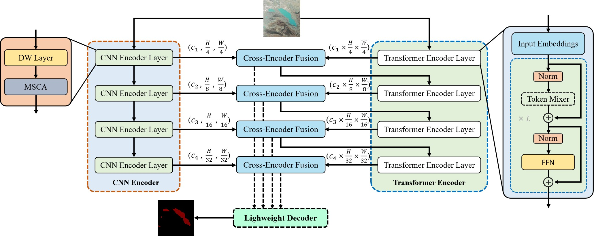

# LEFormer: A Hybrid CNN-Transformer Architecture for Accurate Lake Extraction from Remote Sensing Imagery



The repository contains official PyTorch implementations of training and evaluation codes and pre-trained models for **LEFormer**.

[//]: # (The paper is in [Here]&#40;https://arxiv.org/pdf/2209.08575.pdf&#41;.)

The code is based on [MMSegmentaion v0.30.0](https://github.com/open-mmlab/mmsegmentation/tree/v0.30.0).

## Installation

For install and data preparation, please refer to the guidelines in [MMSegmentation v0.30.0](https://github.com/open-mmlab/mmsegmentation/tree/v0.30.0).

[//]: # (Other requirements:)

[//]: # (```pip install timm==0.6.12```)

An example (works for me): ```CUDA 10.1``` and  ```pytorch 1.6.0``` 

```
pip install -U openmim
mim install mmcv-full
cd LEFormer && pip install -e . --user
```

### Datasets download
The Surface Water dataset (SW dataset) is freely available for download [here](https://aistudio.baidu.com/aistudio/datasetdetail/75148).  
The Qinghai-Tibet Plateau Lake dataset (QTPL dataset) is freely available for download [here](http://www.ncdc.ac.cn/portal/metadata/b4d9fb27-ec93-433d-893a-2689379a3fc0). 

## Training

We use 1 GPU for training by default.  

Example: train ```LEFormer``` on ```Surface Water```:

```python
python tools/train.py local_configs/leformer/leformer_256x256_surface_water_160k.py
```

## Evaluation

Example: evaluate ```LEFormer``` on ```Surface Water```:

```python
python tools/test.py local_configs/leformer/leformer_256x256_surface_water_160k.py local_configs/pretrained_model/leformer_sw.pth --eval mIoU mFscore
```

## FLOPs

To calculate FLOPs for a model.

Example: calculate ```LEFormer``` on ```Surface Water```:

```bash
python tools/get_flops.py local_configs/leformer/leformer_256x256_surface_water_160k.py --shape 256 256
```

[//]: # (## Results)

[//]: # ()
[//]: # (**Notes**: ImageNet Pre-trained models can be found in [xxx Cloud]&#40;&#41;.)

[//]: # ()
[//]: # (### Surface Water)

[//]: # ()
[//]: # (|   Method  |    Backbone     |  Pretrained | Iters | mIoU&#40;ss/ms&#41; | Params | FLOPs  | Config | Download  |)

[//]: # (| :-------: | :-------------: | :-----: | :---: | :--: | :----: | :----: | :----: | :-------: |)

[//]: # (|  SegNeXt  |     MSCAN-T  | IN-1K | 160K | 41.1/42.2 | 4M | 7G | [config]&#40;local_configs/segnext/tiny/segnext.tiny.512x512.ade.160k.py&#41;  | [TsingHua Cloud]&#40;https://cloud.tsinghua.edu.cn/f/5da98841b8384ba0988a/?dl=1&#41; |)

[//]: # (|  SegNeXt  |     MSCAN-S | IN-1K  | 160K |  44.3/45.8  | 14M | 16G | [config]&#40;local_configs/segnext/small/segnext.small.512x512.ade.160k.py&#41;  | [TsingHua Cloud]&#40;https://cloud.tsinghua.edu.cn/f/b2d1eb94f5944d60b3d2/?dl=1&#41; |)

[//]: # (|  SegNeXt  |     MSCAN-B  | IN-1K  | 160K |  48.5/49.9 | 28M | 35G | [config]&#40;local_configs/segnext/base/segnext.base.512x512.ade.160k.py&#41;  | [TsingHua Cloud]&#40;https://cloud.tsinghua.edu.cn/f/1ea8000916284493810b/?dl=1&#41; |)

[//]: # (|  SegNeXt  |     MSCAN-L  | IN-1K  | 160K |  51.0/52.1 | 49M | 70G | [config]&#40;local_configs/segnext/large/segnext.large.512x512.ade.160k.py&#41;  | [TsingHua Cloud]&#40;https://cloud.tsinghua.edu.cn/f/d4f8e1020643414fbf7f/?dl=1&#41; |)

[//]: # ()
[//]: # (### Qinghai-Tibet Plateau Lake)

[//]: # ()
[//]: # (|   Method  |    Backbone     |  Pretrained | Iters | mIoU&#40;ss/ms&#41; | Params | FLOPs  | Config | Download  |)

[//]: # (| :-------: | :-------------: | :-----: | :---: | :--: | :----: | :----: | :----: | :-------: |)

[//]: # (|  SegNeXt  |     MSCAN-T  | IN-1K | 160K | 79.8/81.4 | 4M | 56G | [config]&#40;local_configs/segnext/tiny/segnext.tiny.1024x1024.city.160k.py&#41;  | [TsingHua Cloud]&#40;https://cloud.tsinghua.edu.cn/f/b1613af9955849bba910/?dl=1&#41; |)

[//]: # (|  SegNeXt  |     MSCAN-S | IN-1K  | 160K |  81.3/82.7  | 14M | 125G | [config]&#40;local_configs/segnext/small/segnext.small.1024x1024.city.160k.py&#41;  | [TsingHua Cloud]&#40;https://cloud.tsinghua.edu.cn/f/14148cf5371a4f248db1/?dl=1&#41; |)

[//]: # (|  SegNeXt  |     MSCAN-B  | IN-1K  | 160K |  82.6/83.8 | 28M | 276G | [config]&#40;local_configs/segnext/base/segnext.base.1024x1024.city.160k.py&#41;  | [TsingHua Cloud]&#40;https://cloud.tsinghua.edu.cn/f/adb49029f66f426bb046/?dl=1&#41; |)

[//]: # (|  SegNeXt  |     MSCAN-L  | IN-1K  | 160K |  83.2/83.9 | 49M | 578G | [config]&#40;local_configs/segnext/large/segnext.large.1024x1024.city.160k.py&#41;  | [TsingHua Cloud]&#40;https://cloud.tsinghua.edu.cn/f/b5308d092b034f81aac0/?dl=1&#41; |)

## Acknowledgment

Our implementation is mainly based on [mmsegmentaion](https://github.com/open-mmlab/mmsegmentation/tree/v0.30.0), [Segformer](https://github.com/NVlabs/SegFormer) and [PoolFormer](https://github.com/sail-sg/poolformer). Thanks for their authors.

## LICENSE

This repo is under the Apache-2.0 license. For commercial use, please contact the authors.
